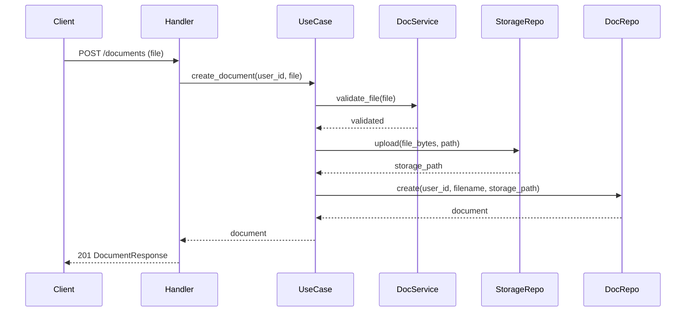
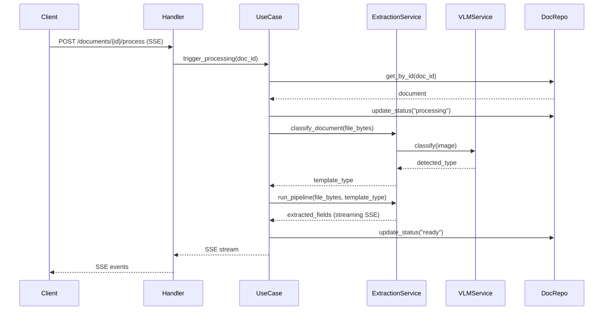
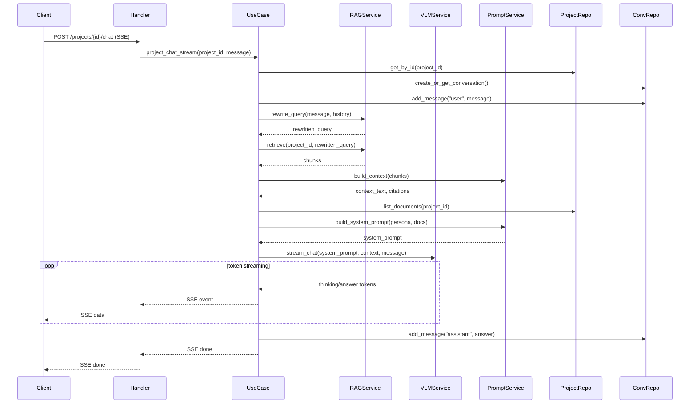
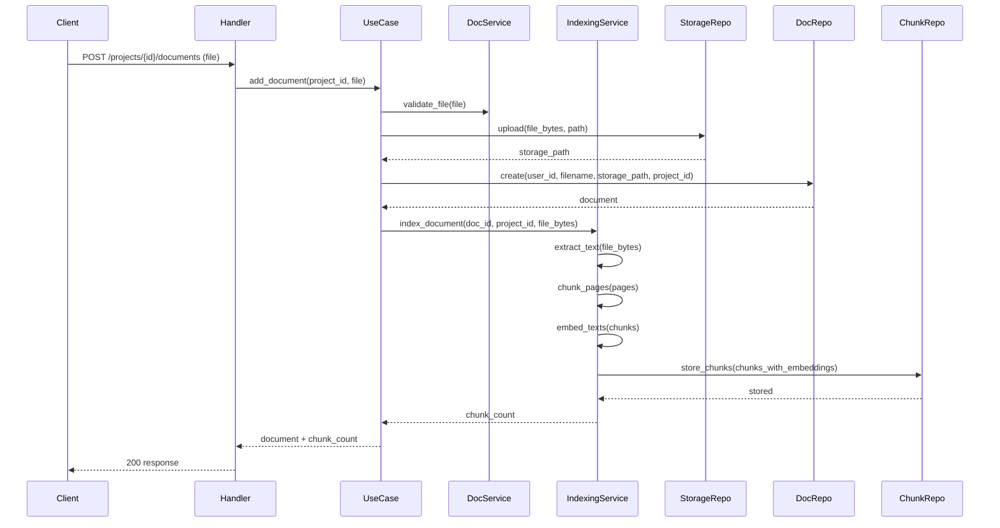
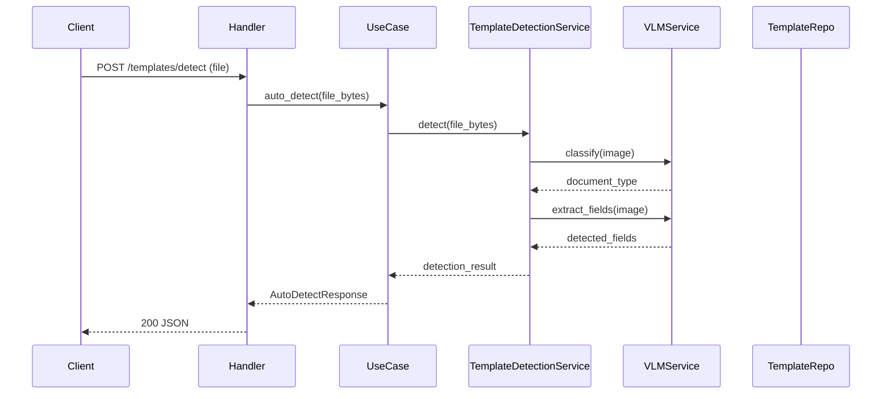

# Architecture Layers — Strict Boundaries

## Overview

Every module follows a strict layered architecture. Each layer has a clear responsibility and boundary. Violations (e.g., usecase calling library directly) are **bugs**.

```
HTTP Request
    │
    ▼
┌─────────────────────────────────────────────────────┐
│  handler.py                                          │
│  - Parse HTTP (params, body, auth)                   │
│  - Call usecase                                      │
│  - Return HTTP response (status code, serialization) │
│  - NO business logic, NO I/O                         │
└────────────────────┬────────────────────────────────┘
                     │
                     ▼
┌─────────────────────────────────────────────────────┐
│  usecase.py                                          │
│  - Orchestration + Business Logic                    │
│  - Instantiates services + repositories in __init__  │
│  - Calls service methods + repository methods        │
│  - Business decisions (validation, authorization)    │
│  - Error handling, retry logic, flow control         │
│  - SSE streaming coordination                        │
│  - NEVER calls library directly                      │
│  - NEVER does I/O directly                           │
└──────────┬─────────────────────┬────────────────────┘
           │                     │
           ▼                     ▼
┌──────────────────┐  ┌──────────────────────────────┐
│  repository.py   │  │  services.py (multiple)       │
│  - Data storage  │  │  - Sub-business logic         │
│  - DB queries    │  │  - External API calls         │
│  - File storage  │  │  - Library calls              │
│  - Can call      │  │  - Prompt building            │
│    library if    │  │  - Data transformation        │
│    needed        │  │                               │
│                  │  │  Calls library/* for:         │
│  Types:          │  │  - VLM providers              │
│  - DB repo       │  │  - RAG operations              │
│  - Storage repo  │  │  - CV processing               │
│                  │  │  - Embedding                   │
└────────┬─────────┘  └──────────────┬────────────────┘
         │                           │
         │         ┌─────────────────┘
         │         │
         ▼         ▼
┌──────────────────────────────┐
│  library/*                    │
│  - Shared, reusable code      │
│  - providers/ (VLM APIs)      │
│  - rag/ (chunking, embedding) │
│  - pipeline/ (LangGraph)      │
│  - cv/ (image processing)     │
│  - templates/ (file loader)   │
│                               │
│  NEVER imports from modules/  │
└──────────────────────────────┘
```

---

## Layer Rules

### handler.py
```
CAN:     Parse HTTP, call usecase, return response
CANNOT:  Business logic, DB queries, file I/O, call service, call library, call repository
```

### usecase.py
```
CAN:     Orchestration + business logic
         - Instantiate services + repositories in __init__
         - Call their methods, coordinate the flow
         - Business decisions (if/else, validation, authorization)
         - Error handling and retry logic
         - Data transformation between layers
         - SSE streaming coordination
CANNOT:  Call library directly, do DB queries, do file I/O, do API calls, use @staticmethod
```

### services.py
```
CAN:     Sub-business logic (delegated by usecase)
         - Call library modules for low-level operations
         - Call external APIs (VLM providers, embedding APIs)
         - Data transformation, formatting, prompt building
         - Encapsulate complex operations into simple method calls
         - Usecase says WHAT to do, service knows HOW to do it
CANNOT:  DB queries (that's repository), HTTP parsing (that's handler)
         Make high-level business decisions (that's usecase)
```

**Usecase vs Service:**
- Usecase = **high-level business logic** ("if document not processed, classify then extract then store")
- Service = **sub-business logic** ("here's how to classify: convert to image, call VLM, parse response")

### repositories.py
```
CAN:     Database queries (SQLAlchemy), file storage operations (Supabase Storage)
         Call library if needed (e.g., storage helpers, data serialization)
CANNOT:  Business logic, external API calls (VLM, embedding), prompt building
```

### schemas.py
```
CAN:     Pydantic models for request/response, type definitions
CANNOT:  Logic of any kind
```

### library/*
```
CAN:     Shared reusable code, provider abstractions, RAG components, CV tools
CANNOT:  Import from modules/, access module-specific state
```

---

## Repository Types

Repository is **any data storage**, not just database:

| Repository | Storage | Examples |
|-----------|---------|----------|
| `DocumentRepository` | PostgreSQL | CRUD documents table |
| `StorageRepository` | Supabase Storage | Upload/download files |
| `ExtractionRepository` | PostgreSQL | CRUD extractions, fields |
| `ChatRepository` | PostgreSQL | CRUD messages, citations |
| `ChunkRepository` | PostgreSQL | CRUD page_chunks (RAG) |

---

## Service Guidelines

- **Many small services > one big service**
- Each service has a focused responsibility
- Services are proper classes with `__init__`, NOT static methods
- Services call library modules for low-level operations
- If library doesn't have what you need, add it to library first, then call from service

| Service | Responsibility | Calls Library |
|---------|---------------|---------------|
| `VLMService` | VLM provider interactions (extract, classify, chat, stream) | `library/providers/` |
| `RAGService` | RAG operations (embed, retrieve, rewrite query) | `library/rag/` |
| `IndexingService` | Document indexing (extract text, chunk, embed, store) | `library/rag/indexer` |
| `ChatPromptService` | Build chat prompts, format fields, slice history | — (pure logic) |
| `ExtractionService` | Extraction pipeline orchestration | `library/pipeline/` |
| `CVService` | Image preprocessing (deskew, quality) | `library/cv/` |
| `TemplateDetectionService` | Auto-detect document type from image | `library/providers/` |

---

## Instantiation Pattern

Services and repositories are instantiated in usecase `__init__`:

```python
class ProjectUseCase:
    def __init__(self) -> None:
        # Repositories (data access)
        self.project_repo = ProjectRepository()
        self.conversation_repo = ConversationRepository()
        self.storage_repo = StorageRepository()

        # Services (business logic + external calls)
        self.rag_service = RAGService()
        self.vlm_service = VLMService()
        self.prompt_service = ProjectPromptService()

    async def project_chat_stream(self, ...):
        # Orchestrate only — delegate everything
        project = await self.project_repo.get_by_id(...)

        rewritten = await self.rag_service.rewrite_query(message, history)
        chunks = await self.rag_service.retrieve(project_id, rewritten)

        context = self.prompt_service.build_context(chunks)
        system_prompt = self.prompt_service.build_system_prompt(persona, docs)

        async for token in self.vlm_service.stream_chat(system_prompt, context, message):
            yield token
```

---

## What NOT To Do

```python
# BAD: usecase calls library directly
class ProjectUseCase:
    async def chat(self):
        from docmind.library.providers.factory import get_vlm_provider  # WRONG
        provider = get_vlm_provider()  # WRONG
        response = await provider.chat(...)  # WRONG

# BAD: usecase uses @staticmethod
class ChatUseCase:
    @staticmethod  # WRONG
    def format_fields(fields):
        ...

# BAD: handler calls repository
@router.get("/projects/{id}/chunks")
async def list_chunks(project_id: str):
    async with AsyncSessionLocal() as session:  # WRONG — should go through usecase → repo
        ...

# BAD: service does DB queries
class ChatService:
    async def get_history(self):
        async with AsyncSessionLocal() as session:  # WRONG — that's repository's job
            ...
```

---

## Flow Diagrams

### Document Upload Flow



### Document Processing Flow



### Project RAG Chat Flow



### Document Upload to Project + RAG Indexing



### Template Auto-Detect Flow



---

## Module Structure Template

Every module MUST have:

```
modules/{name}/
├── __init__.py
├── schemas.py              # Pydantic request/response models
├── repositories.py         # Database + storage access
├── services.py             # Business logic + library/API calls (can be multiple files)
├── usecase.py              # Orchestration only
└── apiv1/
    ├── __init__.py
    └── handler.py           # HTTP interface
```

Services can be split into multiple files if they have different responsibilities:

```
modules/projects/
├── services/
│   ├── __init__.py
│   ├── prompt_service.py    # Prompt building
│   ├── rag_service.py       # RAG operations
│   └── indexing_service.py  # Document indexing
```

Or kept in one `services.py` with multiple classes if the module is small.
